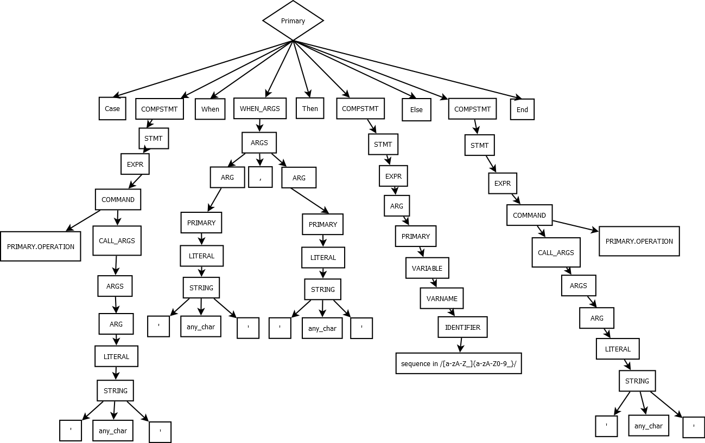

# Dados do Aluno:

* Universidade Federal de Goiás
* Aluno: Marco Túlio Macedo Rodrigues
* Matricula: 135834
* Disciplina: Linguagens de Programação
* Lista 1 de exercicios.

--------------------------------------------------------------------------------
# BNF-Swich-Ruby
Implementação de um Switch Case em Ruby. Como foco estudar a BNF da linguagem.

--------------------------------------------------------------------------------
# Exemplo de um switch/case em Ruby:

```ruby
  case op 
    when '+','-' then puts  'Operacao Basica Encontrada'
  else
    puts 'Operacao Basica nao encontrada'
  end ## Fim do case
```
--------------------------------------------------------------------------------
# Arvore Sintática Gerada para o exemplo:

<p align="center"></p>

--------------------------------------------------------------------------------
# Semantica Operacional Gerada para o exemplo:

<p>
<b>if</b> (op == '+') <b>goto</b> case1-l <br/>
      <b>goto</b> pre-case1-l
</p>
<p>
<em><b>pre-case1-l:</b></em> if(op == '-') <b>goto</b> case1-l <br>
             <b>goto</b> default-l
<p>
<p>
<em><b>case1-l:</b></em> statement-case1; <b>goto</b> fora
</p>
<p>
<em> <b>default-l:</b></em> statement-default;
</p>
<p>
<em> <b> fora: </b> </em>
</p>
